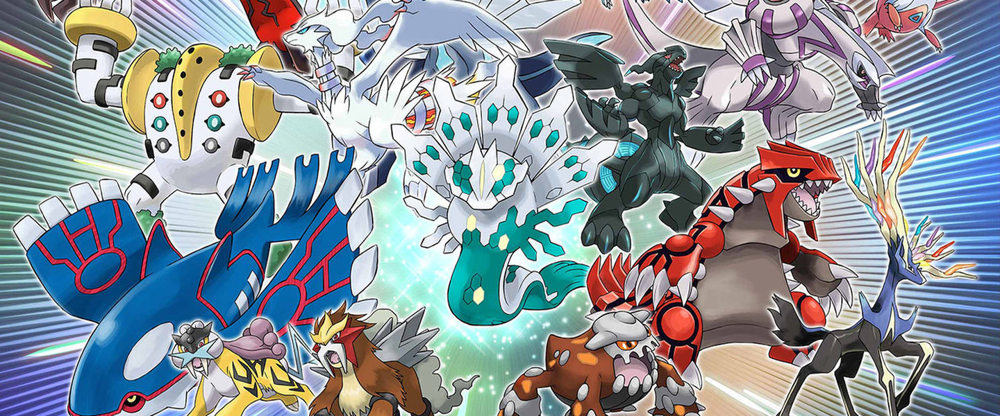

```{r setup, include=FALSE, echo=FALSE}
knitr::opts_chunk$set(echo = TRUE)

## cargamos el fichero de datos
input_data <- readr::read_csv("./data/Pokemon.csv")

names(input_data)[1] <- "ID Pokémon"

### cargamos algunas librerías que nos serán útiles
library(data.table)
library(ggplot2)
library(reshape2)

library(rpart)
library(rattle)
library(rpart.plot)
library(RColorBrewer)
```

## Descripción del dataset.¿Por qué es importante y qué pregunta pretende responder?



Se trata de un listado de todos los pokémons desde la primera generación hasta la sexta. Se encuentra disponible en kaggle en la siguiente ubicación: <https://www.kaggle.com/abcsds/pokemon>.

### Descripción de los campos
* *\#* : Identificador del pokémon dentro del juego (por simplicidad, lo renombramos a *ID Pokémon*)
* *Name*: Nombre del pokémon
* *Type 1*: Tipo del pokémon (agua, fuego, planta, dragón...)
* *Type 2*: Segundo tipo del pokémon (puede ser nulo en pokémons que no tengan más de un tipo)
* *Total*: Suma de los stats numéricos (HP, Attack, Defense, Sp. Attack, Sp. Def, Speed) del pokémon
* *HP*: Puntos de vida
* *Attack*: Puntuación de ataque
* *Defense*: Puntuación de defensa
* *Sp. Atk*: Puntuación de ataque especial
* *Sp. Def*: Puntuacion de defensa especial
* *Speed*: Velocidad
* *Generación*: La generación indica el juego en que apareció. Primera generación sería la original (el primer videojuego para _game boy_ azul, rojo y adicionalmente amarillo). Hasta la 6.
* *Legendary*: Flag que nos indica que ese pokémon es o no de tipo legendario


### ¿Qué pregunta pretende resolver? 
Se trata de entender mejor cómo son los pokémons, tener datos para ver qué diferencias hay entre generaciones, entre tipologías, e incluso ser capaces de tener datos que nos ayuden a crear el mejor escuadrón de pokémons entre jugadores serios.

En nuestro caso, vamos a tratar de resolver una pregunta sencilla: ¿Podríamos predecir los pokémons legendarios por sus stats? En la práctica, crearemos un clasificador que nos ayude a distinguir entre los pokémons legendarios y no legendarios.


## Integración y selección de los datos a analizar

Veamos primero un resumen de estos campos

```{r input summary}
summary(input_data)

```

Lo cual nos indica ya alguna cosa interesante, como por ejemplo que de las 800 líneas, hay _65 correspondientes a pokémons legendarios_... *¿Qué hace que un pokémon sea o no legendario?*

Otra cosa que llama la atención es en el primer campo, el identificador, vemos que nos puede dar problemas a la hora de invocarlo porque la almohadilla tiene otros usos. Así que vamos a renombrarlo. Vemos además que tenemos un total de _721 pokémons diferentes_. Las repeticiones vemos que se tratan de, por ejemplo, las "mega evoluciones", que no están identificadas en el set de datos y vamos a tratar de discernir también. 

Vamos a ver además si en estos campos tenemos valores nulos que deban ser tratados.

```{r na_values}
na_count <- sapply(input_data, function(y) sum(length(which(is.na(y)))))

data.table::data.table("Nombre del campo" = names(na_count),"#NAs" = na_count)

```

Vemos que el único que tiene valores nulos es el de la tipología del pokémon. Pero en este caso son valores reales, porque no todos los pokémons tienen dos tipologías. Por simplicidad sólo tendremos en cuenta el primer tipo, porque es el que está documentado como el tipo principal.

Para evitar duplicados en pokémons con características diferentes (por ejemplo, megaevoluciones, pokémons de diferentes tamaños con stats diferenciadas...), vamos a coger sólo la primera línea de cada uno de los pokémons con ID repetida. 


```{r}
### Como los datos ya vienen ordenados convenientemente, vamos a hacer un loop sobre cada fila y comprobaremos si la ID es la misma que el anterior, en cuyo caso lo marcaremos para borrar

transformed_data <- input_data

transformed_data$`Type 2` <- NULL ## quitamos la columna

transformed_data$RemoveRow <- FALSE

for(i_row in seq(nrow(transformed_data))){
  if(i_row < 2) next

  if(transformed_data[i_row,]$`ID Pokémon` == transformed_data[i_row-1,]$`ID Pokémon`) 
    transformed_data[i_row,]$RemoveRow <- TRUE
}

transformed_data <- subset(transformed_data, !transformed_data$RemoveRow)

transformed_data$RemoveRow <- NULL

paste0("Numero de filas: ", nrow(transformed_data),", Numero de Pokémons: ", length(unique(transformed_data$`ID Pokémon`)))
```

Vemos que tras esta limpieza, tenemos efectivamente una tabla con tantas filas como pokémons listados.


## Limpieza de los datos 

### Valores nulos
Como discutíamos en la sección anterior, el único campo con valores nulos es el de Type 2, ya que se trata de la tipología secundaria del pokémon, no lo tendremos en cuenta.

### Outliers
Vamos a crear un boxplot para buscar los outliers entre los campos cuantitativos del set de datos.
```{r}
quanti_fields <- c("HP", "Attack","Defense","Sp. Atk","Sp. Def", "Speed")
  
boxplot(transformed_data$HP, transformed_data$Attack, transformed_data$Defense, transformed_data$`Sp. Atk`,transformed_data$`Sp. Def`, transformed_data$Speed,
        names = quanti_fields,
        pars=list(outcol="red"))
```

Vemos que tras hacer un boxplot, unos cuantos puntos que quedan fuera. Vamos a echar un vistazo a qué puntos podrían ser:

```{r}
head(transformed_data[order(transformed_data$HP,decreasing = T),])

```

Vemos que estos pokémons con muchísima defensa, a la vez tienen el resto de stats bastante bajas... ¿Es posible que sobre el total haya menos outliers?

```{r}
boxplot(transformed_data$Total, main = "Total")
```

Podemos verlo más en detalle en un histograma:

```{r}
ggplot2::ggplot(transformed_data, aes(x=Total))  +
    geom_histogram(binwidth=20, colour="black")
```

Aunque sea sólo por curiosidad, veamos cuáles son esos valores tan altos de puntuación total:

```{r}
head(transformed_data[order(transformed_data$Total,decreasing = T),])
```

Efectivamente, ¡parece que los *pokémons legendarios* son los valores más limite entre los pokémons! Al menos desde lo alto.

¿Y qué pasa con los valores más bajos?

```{r}
head(transformed_data[order(transformed_data$Total,decreasing = F),])
```

Parece que los pokémon de tipo "hierba" y "bicho" son de los que tienen peores stats. No parece tampoco que pueda ser incorrecto, al final son los primeros pokémons que nos encontramos en el juego, pero rara vez se utilizan en muy grandes niveles por algo.

Por tanot, en resumen, no identificamos valores extremos que deban ser tratados porque los pokémons se han diseñado para que tengan stats diferenciados uno a uno.


## Análisis de los datos 

Vamos a tener en cuenta para este apartado que el objetivo es esutdiar las diferencias entre la población de pokémons legendarios y no legendarios.

### Test de normalidad

Vamos a aplicar el test de Shappiro Wilk sobre las variables cuantitativas. 

Probémoslo primero para el total:

```{r}
cat("Legendary Pokémons:")
legendary_data <- subset(transformed_data, transformed_data$Legendary == T)
shapiro.test(legendary_data$Total)
cat("Non Legendary Pokémons:")
non_legendary_data <- subset(transformed_data, transformed_data$Legendary == F)
shapiro.test(non_legendary_data$Total)
```

Debería tener un p-value > 0.05, que no es el caso. 

Miremos ahora para el resto de variables cuantitativas:

```{r}
pvalue_shapirotest <- function(df){
  shapiro.test(df)$p.value
}
cat("Legendary Pokémons:\n")
apply(legendary_data[,quanti_fields], 2, pvalue_shapirotest)
cat("\nNon Legendary Pokémons:\n")
apply(non_legendary_data[,quanti_fields], 2, pvalue_shapirotest)
```

Vemos que variable por variable, para los pokémons legendarios quizá sí que podríamos asumir que se distribuye normalmente. No así para los pokémons no legendarios.

### Test de homocedasticidad
Aunque quizá no tenga mucho sentido realizar el test sin que cumpla la normalidad, lo realizaremos por propósitos didácticos. Realizaremos el test de Bartlet.

Probémoslo primero para el total:

```{r}
bartlett.test(transformed_data$Total, g = paste0(transformed_data$Legendary))
```

Como era de esperar, los datos no pasan el test de homocedasticidad.


### Análisis de los datos 
Como los datos no muestran ser homogéneos en las varianzas ni se distribuyen normalmente, vamos a tener que hacer análisis más robustos. HAn sido barajadas pruebas estadísticas no paramétricas equivalentes a, por ejemplo, ANOVA, como el test de KRuskall-Wallis, pero estos tests siguen esperando que nuestros datos estén distribuidos con una función de densidad parecida, que sólo con ver las diferencias en el test de normalidad ya vemos que no.

Por ello vamos a evitar utilizar tests de hipótesis y regresiones, que parece que no sean adecuadas para nuestros datos.

#### Método 1: Reducción dimensional
Vamos a ver si reduciendo las dimensiones, podemos gráficamente distinguir a los pokémons legendarios del resto. Vamos a probar con un análisis de componentes princiupales

```{r PCA_Analysis}

quanti_data <- transformed_data[,c(quanti_fields)]

poke_pca <- prcomp(quanti_data)

summary(poke_pca)
```

Vemos que con las dos primeras componentes ya podemos explicar un 62% de la varianza de los datos. 

Echemos un vistazo a ver qué tal podemos distinguir entre pokémons legendarios y no legendarios:

```{r}
# ggplot(df_pca,aes(x=PC1,y=PC2,color=Legendary )) + geom_point()
ggplot(transformed_data,aes(x=Total,y=Attack,color=Legendary )) + geom_point()
```

Vemos que con la primera componente tenemos una muy buena capacidad de predicción. ¿Cuál sería la matriz de confusión?


```{r pca_matr}
transformed_data$LegendaryMeth1a <- FALSE

transformed_data[poke_pca$x[,1] < -60,]$LegendaryMeth1a <- TRUE

table(transformed_data$Legendary, transformed_data$LegendaryMeth1a)
```


Antes hemos visto que entre los pokémons con un valor de stats total mayor, parecía que podía haber más legendarios. ¿Por qué no lo comparamos?

```{r}
ggplot2::ggplot(transformed_data, aes(x=Total, color = Legendary)) +
  geom_histogram(aes(color = Legendary, fill = Legendary), 
                position = "identity", binwidth = 25, alpha = 0.4) +
  scale_color_manual(values = c("#00AFBB", "#E7B800")) +
  scale_fill_manual(values = c("#00AFBB", "#E7B800"))
```

Por el método utilizando el total, habríamos tenido:

```{r total_matr}
transformed_data$LegendaryMeth1b <- FALSE

transformed_data[transformed_data$Total > 575,]$LegendaryMeth1b <- TRUE

table(transformed_data$Legendary, transformed_data$LegendaryMeth1b)
```

Es decir, estaríamos cogiendo 15 falsos positivos vs 16. 

Aquí además estamos viendo un objetivo secundario cumplido: ¿Podríamos identificar estos 15 pokémons que parecen legendarios pero no lo son? Seguro que son más fáciles de encontrar en el juego, pero siguen siendo muy buenos.

```{r}
subset(transformed_data, transformed_data$LegendaryMeth1b == TRUE & transformed_data$Legendary == FALSE)
```

¿No era Mew un pokémon legendario? Aparentemente, aunque Mewtwo (su clon) sí que es  legendario, no es así Mew que se trata de un pokémon míticov <https://bulbapedia.bulbagarden.net/wiki/Mythical_Pok%C3%A9mon>, al igual que otros pokémons de esta lista: Celebi y Manaphy. Son descritos de forma semejante a los legendarios, como pokémons rarísimos y muy poderosos.

Mirando los datos del listado de míticos, aparentemente hay otros pokémons que son a la vez míticos y legendarios como Volcanion, pero está claro que es un factor de confusión. Pero no lo sería para la mayoría de estos pokémons.

#### Método 2: Correlaciones entre variables
Vamos a mirar si hay alguna diferencia entre las correlaciones entre variables de los pokémons legendarios o no legendarios.

Primero miremos los pokémons legendarios:
```{r corrplot_legendarios}

matriz <- cor(subset(quanti_data,transformed_data$Legendary == T))
m <- melt(matriz)
m$value_lab<-sprintf('%.2f',m$value)

ggplot(m, aes(Var2, Var1, fill = value, label=value_lab),color='blue') + 
  geom_tile() + 
  geom_text() +
  xlab('')+
  ylab('')+
  theme_minimal()
```

y comparemos con los no legendarios:

```{r corrplot_no_legendarios}

matriz <- cor(subset(quanti_data,transformed_data$Legendary == F))
m <- melt(matriz)
m$value_lab<-sprintf('%.2f',m$value)

ggplot(m, aes(Var2, Var1, fill = value, label=value_lab),color='blue') + 
  geom_tile() + 
  geom_text() +
  xlab('')+
  ylab('')+
  theme_minimal()
```

¡Es muy interesante! Los pokémons legendarios parece que nos obligan mucho más a tomar concesiones: Si quieres un pokémon con buena salud, deberás comprometer tu defensa en un legendario, pero con los no legendarios no. Una razón para que esto ocurra, es porque al tener en general stats muy altos nos obligan a comprometer o un pokémon con muy buena defensa y ataque podría resultar demasiada ventaja competitiva. Comprobémoslo entre los pokémons con unos stats totales más altos (>550):

```{r corrplot_grandotes_no_legendarios}

matriz <- cor(subset(quanti_data,transformed_data$Legendary == F & transformed_data$Total > 550))
m <- melt(matriz)
m$value_lab<-sprintf('%.2f',m$value)

ggplot(m, aes(Var2, Var1, fill = value, label=value_lab),color='blue') + 
  geom_tile() + 
  geom_text() +
  xlab('')+
  ylab('')+
  theme_minimal()
```

Resulta interesante, la suposición de que el valor de la suma total de stats podría ser un factor a tener en cuenta al mirar la matriz de correlación era acertada. Una vez filtrado por magnitudes semejantes, vemos que no sólo la primera idea de que los pokémons legendarios eran más exigentes a la hora de pedirnos concesiones era errónea... sino que resulta opuesta. Parece que los pokémons legendarios cumplen por ahora dos características:

1. Un volumen total de stats elevado
2. Los stats están repartidos más equitativamente. Cualitativamente vemos que nos exige menos entre los pares de ataque-ataque especial y defensa-defensa especial que es donde probablemente haya más diferencia entre pokémons de volumen de stats semejante pero legendario vs no-legendario.

#### Método 3: Creamos un clasificador
Con toda esta información, añadimos a las variables cualitativas tres nuevos campos:
1. La suma del total
2. Defensa/Defensa Especial
3. Ataque/Ataque Especial

Parece que estas tres variables deberían darnos buen resultado para hacer un clasificador numérico.

```{r feature_engineering}
quanti_data$Total <- transformed_data$Total
quanti_data$Legendary <- transformed_data$Legendary
quanti_data$ATAvsSp <- quanti_data$Attack / quanti_data$`Sp. Atk`
quanti_data$DEFvsSp <- quanti_data$Defense / quanti_data$`Sp. Def`
list_of_pokemons <- transformed_data$Name

```

Ahora vamos a hacer un sencillo clasificador bayesiano. 

Primero, vamos a partir el set de datos en uno de entrenamiento y uno de test

```{r}
set.seed(123123) #para asegurarnos la reproducibilidad
smp_size <- floor(0.70 * nrow(quanti_data))
train_ind <- sample(seq_len(nrow(quanti_data)), size = smp_size)

train <- quanti_data[train_ind, ]
test <- quanti_data[-train_ind, ]

fit <- rpart(Legendary ~ ., data= train, method = "class")
fancyRpartPlot(fit,sub = "")

```

Y comprobamos la matriz de confusión

```{r}
table(test$Legendary,predict(fit,newdata = test, type = "class"))
```

Vemos que el clasificador a la hora de hacer el ajuste, no ha escogido las dos nuevas _features_ que hemos creado. Por propósito didáctico, vamos a forzarle a que lo utilize a ver si el resultado es mucho peor.

Primero veamos una gráfica de dispersión, a ver qué aspecto tiene con dos de esas variables:
```{r}
ggplot(quanti_data,aes(x=Total,y=ATAvsSp,color=Legendary )) + geom_point()
```


Veamos ahora qué tal funciona el clasificador

```{r}
set.seed(123123) #para asegurarnos la reproducibilidad
smp_size <- floor(0.70 * nrow(quanti_data))
train_ind <- sample(seq_len(nrow(quanti_data)), size = smp_size)

train <- quanti_data[train_ind, c("Total","ATAvsSp","DEFvsSp","Legendary") ]
test <- quanti_data[-train_ind, c("Total","ATAvsSp","DEFvsSp","Legendary")]

fit <- rpart(Legendary ~ ., data= train, method = "class")
fancyRpartPlot(fit,sub = "")
```

```{r}
table(test$Legendary,predict(fit,newdata = test, type = "class"))
```

Vemos que el performance es prácticamente igual. Si complicáramos algo más el clasificador, es posible que uno de estos ratios entre ataque y ataque especial ya bastara además del total para hacer un buen clasificador, que además al tener menos pasos en el árbol podríamos considerarlo como mejor para escalar.


## Conclusiones

¿Hemos obtenido el resultado buscado? En mi opinión sí, aunque siempre se podría realizar un análisis más en profundidad, comprobar distintos clasificadores, por ejemplo. Hemos aprendido qué hace que un pokémon sea legendario... No solo tienen muy buenas stats en general, sino que te fuerzan menos a tomar compromisos. Es decir. ¿que hace que un pokémon sea legendario? Su *potencia* y su *versatilidad*.


